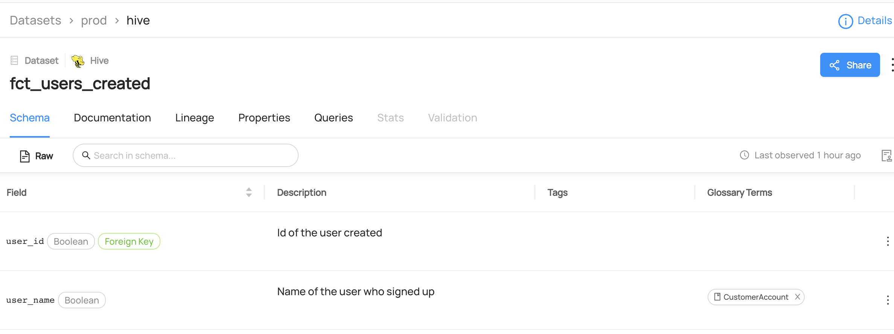

# Adding Terms

## Why Would You Add Terms? 
The Business Glossary(Term) feature in DataHub helps you use a shared vocabulary within the orgarnization.

Let's say you are working in a company called Longtail Companion, a pet adaoption organization with two teams: Adoption and Platform. 
Both teams use the term "Return rate", but the meaning is different.
For the Adoption team, return rates refer to the number of pets returned to the organization by their adoptive families, while for the Platform team, return rate is the percentage of users who returned to the platform after their initial visit. 

To address this, the Business Glossary feature in DataHub can be helpful. 
By creating distinct glossary terms and associating them with specific datasets, each team can access the information they need without the risk of confusion or misinterpretation.

Fore more information about terms, refer to [About DataHub Business Glossary](https://datahubproject.io/docs/glossary/business-glossary).

## Pre-requisites
For this tutorial, you need to deploy Datahub Quickstart and ingest sample data. 
For detailed information, please refer to [Prepare Local Datahub Environment](http://yoonhyejin.github.io/datahub-forked/docs/dev-guides/tutorials/references/prepare-datahub).

:::note
Adding terms assumes that you already have a dataset and terms on your datahub.
If you try to manipulate with entities that does not exist, it might return errors or failed to reference them.
:::


## Add Terms With Python SDK

Following codes add a glossary term named `CustomerAccount` to a column `user_name` of a hive dataset named `fct_users_created`.
You can refer to a full code in [dataset_add_column_term.py](https://github.com/datahub-project/datahub/blob/master/metadata-ingestion/examples/library/dataset_add_column_term.py).


```python
# inlined from metadata-ingestion/examples/library/dataset_add_column_term.py
import logging
import time

from datahub.emitter.mce_builder import make_dataset_urn, make_term_urn
from datahub.emitter.mcp import MetadataChangeProposalWrapper

# read-modify-write requires access to the DataHubGraph (RestEmitter is not enough)
from datahub.ingestion.graph.client import DatahubClientConfig, DataHubGraph

# Imports for metadata model classes
from datahub.metadata.schema_classes import (
    AuditStampClass,
    EditableSchemaFieldInfoClass,
    EditableSchemaMetadataClass,
    GlossaryTermAssociationClass,
    GlossaryTermsClass,
)

log = logging.getLogger(__name__)
logging.basicConfig(level=logging.INFO)


def get_simple_field_path_from_v2_field_path(field_path: str) -> str:
    """A helper function to extract simple . path notation from the v2 field path"""
    if not field_path.startswith("[version=2.0]"):
        # not a v2, we assume this is a simple path
        return field_path
        # this is a v2 field path
    tokens = [
        t for t in field_path.split(".") if not (t.startswith("[") or t.endswith("]"))
    ]

    return ".".join(tokens)


# Inputs -> the column, dataset and the term to set
column = "user_name"
dataset_urn = make_dataset_urn(platform="hive", name="fct_users_created", env="PROD")
term_to_add = make_term_urn("User")


# First we get the current editable schema metadata
gms_endpoint = "http://localhost:8080"
graph = DataHubGraph(DatahubClientConfig(server=gms_endpoint))


current_editable_schema_metadata = graph.get_aspect(
    entity_urn=dataset_urn, aspect_type=EditableSchemaMetadataClass
)


# Some pre-built objects to help all the conditional pathways
now = int(time.time() * 1000)  # milliseconds since epoch
current_timestamp = AuditStampClass(time=now, actor="urn:li:corpuser:ingestion")

term_association_to_add = GlossaryTermAssociationClass(urn=term_to_add)
term_aspect_to_set = GlossaryTermsClass(
    terms=[term_association_to_add], auditStamp=current_timestamp
)
field_info_to_set = EditableSchemaFieldInfoClass(
    fieldPath=column, glossaryTerms=term_aspect_to_set
)

need_write = False
field_match = False
if current_editable_schema_metadata:
    for fieldInfo in current_editable_schema_metadata.editableSchemaFieldInfo:
        if get_simple_field_path_from_v2_field_path(fieldInfo.fieldPath) == column:
            # we have some editable schema metadata for this field
            field_match = True
            if fieldInfo.glossaryTerms:
                if term_to_add not in [x.urn for x in fieldInfo.glossaryTerms.terms]:
                    # this tag is not present
                    fieldInfo.glossaryTerms.terms.append(term_association_to_add)
                    need_write = True
            else:
                fieldInfo.glossaryTerms = term_aspect_to_set
                need_write = True

    if not field_match:
        # this field isn't present in the editable schema metadata aspect, add it
        field_info = field_info_to_set
        current_editable_schema_metadata.editableSchemaFieldInfo.append(field_info)
        need_write = True

else:
    # create a brand new editable schema metadata aspect
    current_editable_schema_metadata = EditableSchemaMetadataClass(
        editableSchemaFieldInfo=[field_info_to_set],
        created=current_timestamp,
    )
    need_write = True

if need_write:
    event: MetadataChangeProposalWrapper = MetadataChangeProposalWrapper(
        entityUrn=dataset_urn,
        aspect=current_editable_schema_metadata,
    )
    graph.emit(event)
    log.info(f"Term {term_to_add} added to column {column} of dataset {dataset_urn}")

else:
    log.info(f"Term {term_to_add} already attached to column {column}, omitting write")

```

## Add Terms With GraphQL

### GraphQL Explorer
GraphQL Explorer is the fastest way to experiment with GraphQL without any dependancies. 
Navigate to GraphQL Explorer (`http://localhost:9002/api/graphiql`) and run the following query.

```python
mutation addTerms {
    addTerms(
      input: { 
        termUrns: ["urn:li:glossaryTerm:CustomerAccount"], 
        resourceUrn: "urn:li:dataset:(urn:li:dataPlatform:hive,fct_users_created,PROD)",
        subResourceType:DATASET_FIELD,
        subResource:"user_name"})
}
```
You are succeeded if you see the following response.
```python
{
  "data": {
    "addTerms": true
  },
  "extensions": {}
}
```

### CURL

With CURL, you need to provide tokens. To generate token, please refer [Generate Access Token](http://yoonhyejin.github.io/datahub-forked/docs/dev-guides/tutorials/references/generate-access-token). 
With `accessToken`, you can run the following command.

```shell
curl --location --request POST 'http://localhost:8080/api/graphql' \
--header 'Authorization: Bearer <my-access-token>' \
--header 'Content-Type: application/json' \
--data-raw '{ "query": "mutation addTerm { addTerms(input: { termUrns: [\"urn:li:glossaryTerm:CustomerAccount\"], resourceUrn: \"urn:li:dataset:(urn:li:dataPlatform:hive,fct_users_created,PROD)\" }) }", "variables":{}}'
```

Expected Response:

```json
{"data":{"addTerms":true},"extensions":{}}
```

## Expected Outcomes
You can now see `CustomerAccount` tag has been added to `user_name` column. 



## What’s Next

